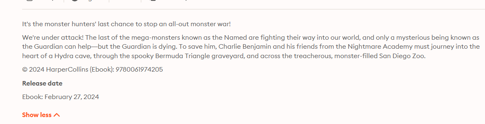
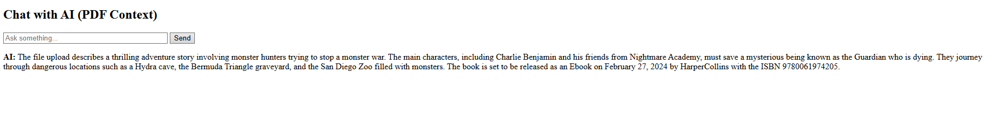

Create Virtual Environment

python -m venv myvenv

myvenv\Scripts\activate.bat

pip install pytesseract pdf2image openai langchain django djangorestframework langchain-community tiktoken
pip install -U langchain-openai

Then go to this link to download tesseract ocr: https://github.com/UB-Mannheim/tesseract/wiki

In file views.py, Change the path to where you install tesseract
pytesseract.pytesseract.tesseract_cmd = r'C:\Program Files\Tesseract-OCR\tesseract.exe'

python manage.py makemigrations
python manage.py migrate
python manage.py runserver

go to link 127.0.0.1:8000

You can upload pdf jpeg png.

After click upload ask the OpenAI. and you will get something like this 

# This project belongs to Bui Thanh Huy (Aaron Bui)
- Email: aaronhuy2509@gmail.com
- Linkedin: https://www.linkedin.com/in/huy-bui-thanh-372a56194/

# System specs:
- Python version: 3.13.4
- Tesseract OCR version: 5.5.0 (20241111)
- Django version 5.2.3
